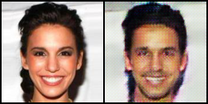
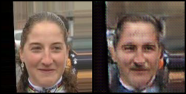
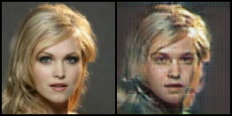
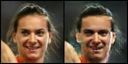
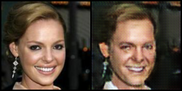
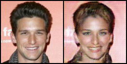
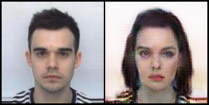
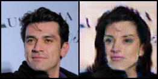

# CycleGAN on Pytorch

Implementation of CycleGAN on Pytorch. The model learns how to convert an image of domain A to an image of domain B and vice versa. On this project, CelebA dataset has been used as the main dataset. The model has learned how to translate a female image to a male image and vice versa.


## Prerequites
* [Python 3.6](https://www.continuum.io/downloads)
* [PyTorch 0.2.0](http://pytorch.org/) (PyTorch is currently available only on Linux and OSX)
* The code has been written on Linux (ubuntu 16.04 LTS) system
* CPU or CUDA-available-GPU


## How to
#### 1. Install Python and PyTorch (from the link above or on your own way)
#### 2. Prepare your own dataset, store it in the project folder (it should contain the images of two domains)
#### 3. Change the dataset location part of 'train.py' code like below
```python
...
# The lowest folder should have two sub-folders, each containing images from another domain
image_location = './data/your_dataset/train'
...
```
#### 4. Run the command below on Terminal
```bash
$ python train.py
```


## Results
### 1) Female to Male










### 2) Male to Female







